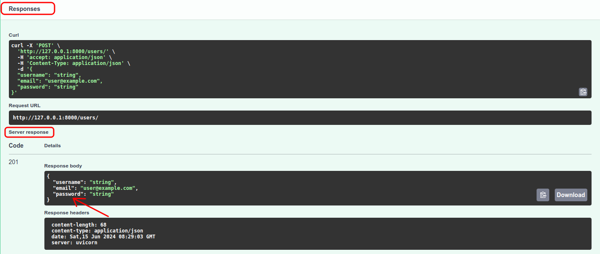

 - Notes on what I learned in course [FastAPI do ZERO (PT-BR)](https://fastapidozero.dunossauro.com/).
 - All notes here will be in Portuguese (Brazil).

# FastAPI do ZERO (PT-BR)

## Conteúdo

 - **Conceitos Gerais:**
   - [Respostas HTTP](#http-responses)
 - **CRUD:**
   - **POST (CREATE):**
     - [Como criar um usuário com FastAPI](#create-user)
     - [Problema de segurança (com retornos) do método POST](#post-problem)
   - **GET (READ):**
   - **PUT (UPDATE):**
   - **DELETE (DELETE):**
 - **Testing:**
 - **FastAPI Settings & Management:**
   - Como iniciar o servidor a partir do FastAPI `(fastapi dev app.py)`
   - Swagger UI (http://127.0.0.1:8000/docs)
   - Redoc (http://127.0.0.1:8000/redoc)
   - [Entendendo o "Uvicorn"](#intro-to-uvicorn)
 - **Project Settings:**
   - [Como abrir um script no modo Interativo](#py-interactive-mode)
   - [Como criar grupos na instalação do Poetry (---group)](#poetry-group)
   - [Como configurar o "Ruff" para analisar o seu código](#ruff-settings)
   - [Entendendo comandos "Ruff"](#ruff-commands)
<!--- 
[WHITESPACE RULES]
- Same topic = "10" Whitespace character.
- Different topic = "50" Whitespace character.
--->


<!--- ( Conceitos Gerais ) --->

---

<div id="http-responses"></div>

## Respostas HTTP

> Toda requisição HTTP retorna um código de resposta.

Por exemplos, vejams alguns códigos abaixo:

- **200 OK: Indica sucesso na requisição.**
	- **GET**: Quando um dado é solicitado e retornado com sucesso.
	- **PUT**: Quando dados são alterados com sucesso.
- **201 CREATED: Significa que a solicitação resultou na criação de um novo recurso.**
	- **POST**: Aplicável quando um dado é enviado e criado com sucesso.
	- **PUT**: Usado quando uma alteração resulta na criação de um novo recurso.
- **204 NO CONTENT: Retorno do servidor sem conteúdo na mensagem.**
	- **PUT**: Aplicável se a alteração não gerar um retorno.
	- **DELETE**: Usado quando a ação de deletar não gera um retorno.

Os códigos de erro mais comuns que temos que conhecer para lidar com possíveis erros na aplicação, são:

- **404 NOT FOUND**: O recurso solicitado não pôde ser encontrado.
- **422 UNPROCESSABLE ENTITY**: O pedido foi bem formado (ou seja, sintaticamente correto), mas não pôde ser processado.
- **500 INTERNAL SERVER ERROR**: Uma mensagem de erro genérica, dada quando uma condição inesperada foi encontrada. Geralmente ocorre quando nossa aplicação apresenta um erro.


<!--- ( CRUD = POST(CREATE), GET(READ), PUT(UPDATE), DELETE(DELETE) ) --->

---

<div id="create-user"></div>

## Como criar um usuário com FastAPI

Seguindo a lógica dos métodos HTTP para criar um usuário no FastAPI precisamos criar um endpoint `POST`:

```python
# app.py
from http import HTTPStatus
from fastapi import FastAPI

app = FastAPI()


@app.post("/users/", status_code=HTTPStatus.CREATED)
def create_user():
    ...
```

Veja que no código acima:

 - Utilizamos o decorador `@app.post` para dizer que é um método HTTP `POST`.
 - Criamos um endpoint chamado `/users/` que vai receber um `JSON` como resposta.
 - `status_code=HTTPStatus.CREATED:`
   - É crucial definir que, ao cadastrar um usuário com sucesso, o sistema deve retornar o código de resposta `201 CREATED`, indicando a criação bem-sucedida do recurso.

> **NOTE:**  
> Porém o nosso endpoint ainda não diz quais campos terão nosso usuário (Lembre que isso pode ser salvo em um Banco de Dados).

Para resolver isso vamos criar um schema com Pydantic:

```python
# schemas.py

from pydantic import BaseModel


class UserPublic(BaseModel):
    username: str
    email: str
```

Agora é só importar esse schema e utilizar ele como mapeamento do nosso endpoint:

```python
# app.py

from tm_api.schemas import UserPublic

from http import HTTPStatus
from fastapi import FastAPI

app = FastAPI()


@app.post("/users/", status_code=HTTPStatus.CREATED)
def create_user(user: UserPublic):
    ...
```

 

> **NOTE:**  
> Veja que nós não precisamos criar os campos do usuário. O Pydantic fez isso para nós. E nós apenas mapeamos para a nossa função `create_user(user: UserPublic)`.

---

<div id="post-problem"></div>

## Problema de segurança (com retornos) do método POST

> **Quando fazemos uma chamada com o método POST o esperado é que os *"dados criados sejam retornados ao cliente"*.**

Levando em consideração a frase acima, qual o problema no endpoint abaixo?

  

> **O endpoint acima retorna a senha do usuário e isso não é uma boa prática de segurança. É ideal não retornar a senha do usuário. Quanto menos ela trafegar na rede, melhor.**

Desta forma, podemos criar um novo schema, porém, sem a senha:

```python
# schemas.py

from pydantic import BaseModel, EmailStr


class UserSchema(BaseModel):
    username: str
    email: EmailStr
    password: str


class UserPublic(BaseModel):
    username: str
    email: EmailStr
```

```python
# app.py

from tm_api.schemas import UserPublic, UserSchema

from http import HTTPStatus
from fastapi import FastAPI

app = FastAPI()


@app.post('/users/', status_code=HTTPStatus.CREATED, response_model=UserPublic)
def create_user(user: UserSchema):
    return user
```

  

Vejam que:

 - **Agora nós temos 2 schemas:**
   - O publico que será retornado no fim da requisição POST.
   - E o normal para criação de dados (Tipo de demonstração).
 - **NOTE:** Vejam que nós também utilizamos o parâmetro `response_model` e passamos como argumento `UserPublic`. Ou seja, esse será o retorno após uma requisição POST (sem a senha).


<!--- ( FastAPI Settings & Management ) --->

---

<div id="intro-to-uvicorn"></div>

## Entendendo o "Uvicorn"

> Embora o FastAPI tenha uma aplicação de terminal que facilita a execução. Para podermos acessar essas APIs por um navegador ou de outras aplicações clientes, é necessário um servidor.

 - É aí que o *"Uvicorn"* entra em cena. *Ele atua como esse servidor*, disponibilizando a API do FastAPI em rede. Isso permite que a API seja acessada de outros dispositivos ou programas.
 - Sempre que usarmos o fastapi para inicializar a aplicação no shell, ele faz uma chamada interna para inicializar o uvicorn. Por esse motivo ele aparece nas respostas HTTP e também na execução do comando.


<!--- ( Project Settings ) --->

---

<div id="py-interactive-mode"></div>

## Como abrir um script no modo Interativo

Para abrir o terminal interativo com o seu código carregado, você deve chamar o Python no terminal usando `-i`:

```bash
python -i <seu_arquivo.py>
```

**NOTE:**  
O interpretador do Python executa o código do arquivo e retorna o shell após executar tudo que está escrito no arquivo.

---

<div id="poetry-group"></div>

## Como criar grupos na instalação do Poetry

Ao instalar novas bibliotecas no nosso projeto, podemos especificar a qual grupo essas bibliotecas pertence. Para isso, basta adicionar a flag `--group` na hora da instalação:

```bash
poetry add --group dev pytest@latest pytest-cov@latest taskipy@latest ruff@latest httpx@latest
```

---

<div id="ruff-settings"></div>

## Como configurar o "Ruff" para analisar o seu código

```toml
[tool.ruff]
line-length = 79

[tool.ruff.lint]
preview = true
select = ['I', 'F', 'E', 'W', 'PL', 'PT']
ignore = ['E402', 'F811']

[tool.ruff.format]
preview = true
quote-style = 'single'
```

 - `[tool.ruff]: Configurações Globais do Ruff.`
   - `extend-exclude = ['migrations']  # Exclude migrations folder from linting.`
 - `[tool.ruff.lint]: Análise de Linter.`
   - **select:**
     - `I` ([Isort](https://pycqa.github.io/isort/){:target="_blank"}): Checagem de ordenação de imports em ordem alfabética
     - `F` ([Pyflakes](https://github.com/PyCQA/pyflakes){:target="_blank"}): Procura por alguns erros em relação a boas práticas de código
     - `E` (Erros [pycodestyle](https://pycodestyle.pycqa.org/en/latest/){:target="_blank"}): Erros de estilo de código
     - `W` (Avisos [pycodestyle](https://pycodestyle.pycqa.org/en/latest/){:target="_blank"}): Avisos de coisas não recomendadas no estilo de código
     - `PL` ([Pylint](https://pylint.pycqa.org/en/latest/index.html){:target="_blank"}): Como o `F`, também procura por erros em relação a boas práticas de código
     - `PT` ([flake8-pytest](https://pypi.org/project/flake8-pytest-style/){:target="_blank"}): Checagem de boas práticas do Pytest
 - `[tool.ruff.format]: Formatação (Formatter) do Ruff.`
   - **NOTE:** Lembrando que a opção de usar aspas simples é totalmente pessoal, você pode usar aspas duplas se quiser.

---

<div id="ruff-commands"></div>

## Entendendo comandos "Ruff"

Nós criamos vários comandos Ruff com o Taskipy. Agora vamos ver e entender eles:

```toml
lint = 'ruff check . && ruff check . --diff'
format = 'ruff check . --fix && ruff format .'
pre_test = 'task lint'
```

Os comandos definidos fazem o seguinte:

 - **lint: Executa duas variações da checagem**
   - `ruff check`: Mostra os códigos de infrações de boas práticas.
   - `ruff check --diff`: Mostra o que precisa ser alterado no código para que as boas práticas sejam seguidas.
   - `&&`: O duplo `&` faz com que a segunda parte do comando só seja executada se a primeira não der erro. Sendo assim, enquanto o `--diff` apresentar erros, ele não executará o `check`
 - **format: Executa duas variações da formatação**
   - `ruff check . --fix`: Faz algumas correções de boas práticas automaticamente.
   - `ruff format`: Executa a formatação do código em relação as convenções de estilo de código


---

Ro**drigo** **L**eite da **S**ilva - **drigols**
